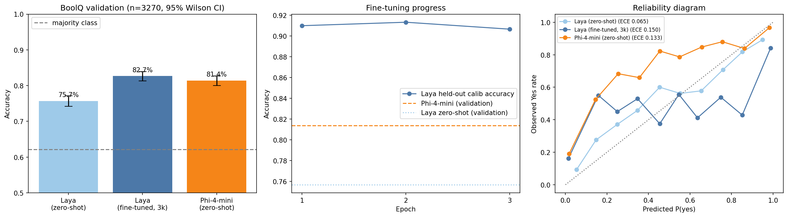

# Can fine-tuned Laya beat Phi-4-mini on BoolQ?

## Question

In [`2026-09-laya-vs-phi4-boolq`](../2026-09-laya-vs-phi4-boolq), zero-shot Laya (421M) scored 75.7% on the full BoolQ validation split (3,270 examples), against 81.4% for zero-shot Phi-4-mini-instruct (3.8B). If Laya is fine-tuned on 3,000 BoolQ training examples, does it beat an off-the-shelf Phi-4-mini?

## Setup

| | Examples | Source | Used for |
|---|---|---|---|
| Train | 3,000 | BoolQ `train`, random sample (seed 42) | Fine-tuning Laya |
| Calibration | 300 | BoolQ `train`, disjoint from the above | Temperature fitting and threshold choice for every model |
| Test | 3,270 | BoolQ `validation`, all of it | All reported numbers |

No validation example is used for training, calibration or tuning. Passages over 400 Laya tokens are truncated the same way for all models.

## Models

| Model | Params | Adaptation |
|---|---|---|
| Laya (zero-shot) | 421M | none; re-scored here as the before-fine-tuning baseline |
| Laya (fine-tuned) | 421M | 3 epochs on 3,000 examples |
| Phi-4-mini-instruct | 3.8B | none (zero-shot, same prompt as the previous experiment) |

## Method

- **Fine-tuning** is a single-T4 port of Laya's [official RLCD recipe](https://github.com/NandhaKishorM/laya/blob/main/notebooks/laya_finetune_typed_decisions_2xT4_kaggle.ipynb). Gaussian exploration noise is added to the answer logits and scored with a proper scoring rule. A policy-gradient loss plus a soft cross-entropy term trains the model, with the noise annealing from 0.4 to 0.1. The learning rates are 2.5e-5 (encoder) and 1e-4 (head), the effective batch is 64 and training runs 3 epochs. Training sequences are built with `laya.common.build_sequence`, so they match inference exactly. After training, a `noul` temperature is fitted on the calibration slice and the checkpoint is saved in the layout `laya.Agent` loads.
- **Phi-4-mini:** its 3,270 predictions are reused from the previous run's `results.csv`, committed here as [`prior_results.csv`](prior_results.csv). The notebook fetches the file from GitHub when it isn't present locally, and it only generates examples missing from the file.
- **Metrics:** accuracy with a 95% Wilson CI at threshold 0.5, plus accuracy at a threshold tuned on the calibration slice. Also F1, ROC-AUC, Brier score, ECE, ms per example and peak GPU memory. The headline is an **exact McNemar test** of fine-tuned Laya against Phi-4-mini on the 3,270 paired answers.

## How to run

1. Click **Open in Colab** above and choose **Runtime → Change runtime type → T4 GPU**.
2. Nothing to upload: `prior_results.csv` is fetched automatically, so Phi-4-mini isn't re-run.
3. **Runtime → Run all.** Fine-tuning takes about 10 minutes and Laya evaluation about 5. Predictions, training history and the checkpoint are cached, so a rerun after a disconnect resumes. Set `USE_DRIVE = True` to keep them on Google Drive.
4. Download the results zip and commit `figures/`, `results.csv` and `summary.csv` here. The ~850 MB checkpoint is not committed.

## Results

Full BoolQ validation split (3,270 examples), Colab T4. Per-example outputs are in [`results.csv`](results.csv). The tuned threshold is chosen for each model on the 300 held-out training examples, never on the test set.

| Model | Accuracy (0.5) | 95% CI | Accuracy (tuned threshold) | ROC-AUC | Brier | ECE | ms / example | Peak GPU memory |
|---|---|---|---|---|---|---|---|---|
| Majority class (always Yes) | 62.2% | | | | | | | |
| Laya (zero-shot) | 75.7% | 74.2–77.1% | 76.3% (0.38) | 0.812 | 0.170 | **0.065** | 48 | **2.4 GB** |
| Laya (fine-tuned, 3k) | **82.7%** | 81.3–83.9% | 82.5% (0.44) | 0.849 | 0.162 | 0.150 | **44** | 4.1 GB |
| Phi-4-mini (zero-shot) | 81.4% | 80.0–82.7% | **85.3%** (0.10) | **0.919** | **0.143** | 0.133 | 118 | 10.5 GB |

Fine-tuning took 9.9 minutes (3 epochs, peak 8.3 GB). The fitted `noul` temperature was 9.2.

**Takeaways**

- **Verdict: fine-tuned Laya matches Phi-4-mini but does not beat it.** At the default 0.5 threshold it leads by 1.3 points, but the exact McNemar test gives p = 0.14 (416 questions only Laya got right, 374 only Phi-4-mini), which is not significant.
- **Fine-tuning itself works.** 3,000 examples and 10 minutes on one T4 raised Laya by 7.0 points (75.7% → 82.7%, p ≈ 1e-21).
- **Passage overlap inflates the lead.** 496 of the 3,270 validation questions (15%) use the same Wikipedia passage as one of the 3,000 training questions. BoolQ's official train and validation splits share passages like this. Fine-tuned Laya scores 87.9% on those and 81.7% on the other 2,774, where Phi-4-mini scores 81.4% (p = 0.73), a dead heat. Phi-4-mini scores the same on both subsets.
- **With tuned thresholds, Phi-4-mini wins.** Phi-4-mini is biased towards *No* (it answers Yes 50% of the time against a true rate of 62%). A threshold of 0.10, chosen on the held-out training slice, lifts it to 85.3%, which is significantly better than fine-tuned Laya (p = 0.0004). Its ROC-AUC (0.919 vs 0.849) shows it still separates Yes from No better.
- **Fine-tuning ruined Laya's calibration.** ECE more than doubled (0.065 → 0.150). About 95% of the fine-tuned model's P(yes) values are below 0.1 or above 0.9, even after the temperature fit, so its 17% of wrong answers are made with near-certainty. (The middle of its reliability curve is noisy because only ~2% of predictions fall there.)
- **Laya stays much cheaper.** It is 9× smaller than Phi-4-mini and about 2.7× faster per example, and it uses less than half the GPU memory at inference.
- **Open question:** fine-tuned Laya scored ~91% on the held-out training slice but 82.7% on validation. Passage overlap doesn't explain it: its accuracy on held-out questions without a shared passage was also 90.8%.

**Next steps to give Laya a fairer shot:** drop training questions whose passage appears in validation, train on the full 9.4k train split, and use fewer epochs or a lower cross-entropy weight to keep its probabilities calibrated.
