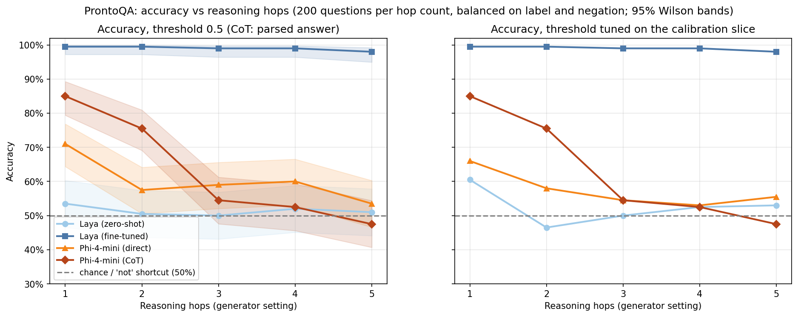

# Laya vs Phi-4-mini on ProntoQA: accuracy vs reasoning hops

## Question

[BoolQ](../2026-09-laya-vs-phi4-boolq) asked whether Laya can *find* an answer in a passage. This experiment asks whether it can *chain* facts together. Laya decides in a single forward pass with no scratchpad, so the hypothesis is that it handles 1-hop questions and falls off as the hop count grows. Phi-4-mini, especially when it reasons step by step before answering, should degrade more slowly. The headline is a plot of accuracy against hop count, which tests that architectural claim directly instead of reporting one leaderboard number. A fine-tuned Laya arm checks whether any fall-off is a lack of training on the task or a limit of the single forward pass.

### Why ProntoQA, not ProofWriter

The [ProofWriter run](../2026-09-laya-vs-phi4-proofwriter) was undermined by a surface cue: ~95% of its False statements contain "not" and ~95% of its True ones don't. "False if it says *not*, otherwise True" scored 64% at every depth without any reasoning, and fine-tuned Laya's flat 66% sat right on top of it.

ProntoQA ([Saparov & He, ICLR 2023](https://openreview.net/forum?id=qFVVBzXxR2V)) was built to test whether chain-of-thought helps as the number of hops grows. Three properties make it a cleaner test:
- **Made-up vocabulary** ("Every wumpus is a yumpus"), so world knowledge can't help.
- **Distractor rules** that assign the opposite property to an unrelated concept, so spotting the property in the text isn't enough.
- **Label and negation are independent in the generated data.** The sample is balanced on both anyway, so a "not"-based guess scores exactly 50%.

## Models

| Arm | Params | How it answers | Hugging Face id |
|---|---|---|---|
| Laya (zero-shot) | 421M | One `noul` (yes/no) question, one forward pass, 512-token window | [`convaiinnovations/laya`](https://huggingface.co/convaiinnovations/laya) (Apache-2.0) |
| Laya (fine-tuned) | 421M | The same, after fine-tuning on 3,000 generated training examples over 1–5 hops | fine-tuned from the above (not committed) |
| Phi-4-mini (direct) | 3.8B | "Answer with only True or False", greedy | [`microsoft/Phi-4-mini-instruct`](https://huggingface.co/microsoft/Phi-4-mini-instruct) (MIT) |
| Phi-4-mini (CoT) | 3.8B | "Reason step by step…", then `Answer: True/False`, greedy, up to 1,024 new tokens | same |

Neither model requires a Hugging Face login.

## Dataset

The data in [`data/`](data) was generated with the authors' official generator, [`asaparov/prontoqa`](https://github.com/asaparov/prontoqa) (Apache-2.0), pinned to commit `0a6412b`. [`scripts/generate_data.sh`](scripts/generate_data.sh) reproduces it exactly.

**Generator settings:**
- `--ontology fictional`
- `--ordering random`: facts and rules are shuffled, so the proof can't be read off in order.
- Relevant distractors (the generator's default).
- Zero-shot: no in-context examples.
- `--min-hops 1 --max-hops 5`.

**Hop count** is the generator's own setting and is never inferred. As a sanity check, the notebook asserts that each gold proof has `2 × hops + 1` steps.

**Sizes:**
- **Test:** seed 1001, 400 generated examples per hop count. The notebook samples **50 questions for every hop × label × contains-"not" cell**, 1,000 in total, so chance is exactly 50% at every hop count.
- **Train:** seed 2002, 700 per hop count. It supplies 3,000 fine-tuning examples and a disjoint 300-example calibration slice, both balanced over hops × label. The notebook checks that no test example appears in train.

Theories are at most 209 Laya tokens, so nothing is truncated. More hops need more rules, so theories get longer with hop count: a mean of 118 tokens at 1 hop and 195 at 5 hops. Hop count and input length therefore move together. Both stay well inside Laya's 512-token window.

The ProntoQA authors released pre-generated data too, but the True/False version only covers 1, 3 and 5 hops and exists only inside GPT-3 prompt logs. The PrOntoQA-OOD files have "Prove: …" queries with no True/False label. Running the pinned generator was the clean way to get every hop count from 1 to 5.

## Method

- **Laya:** the theory is the `state`, and the statement is one `noul` question ("Using only the facts and rules in the text, is this statement true?"). Laya returns P(true), scored at batch size 1.
- **Laya fine-tuned:** the single-T4 port of Laya's official RLCD recipe, unchanged from [`2026-09-laya-finetune-boolq`](../2026-09-laya-finetune-boolq): the same `noul` target and hyperparameters (3 epochs, effective batch 64, LR 2.5e-5 / 1e-4, σ 0.4→0.1). The `noul` temperature is fitted on the calibration slice.
- **Phi-4-mini direct:** greedy decoding with 3 new tokens. P(true) is the softmax over the first token's True/False logits.
- **Phi-4-mini CoT:** reasons step by step, then the last `Answer:` is parsed. Unparsed or cut-off outputs count as wrong, and the parse rate is reported.
- **Thresholds:** for the three arms that output P(true), accuracy is reported at 0.5 *and* at a threshold tuned on the calibration slice. ROC-AUC per hop count is reported too. Together these separate "no signal" from "signal with a yes/no bias". That distinction was hard to make on ProofWriter.
- **Degradation test:**
  - Per arm, a logistic regression of `correct ~ hops` gives the slope in log-odds per extra hop.
  - Across arms, a GEE model `correct ~ hops × arm`, clustered on question, tests whether the slopes differ. It uses each Laya arm as the reference in turn.
  - Exact McNemar tests at each hop count for the key pairs.
- **Also reported:** answer bias against hops (the share answered True), latency, CoT length and peak GPU memory.

## How to run

1. Click **Open in Colab** above and choose **Runtime → Change runtime type → T4 GPU**.
2. Click **Runtime → Run all**. The data files are fetched from this repo automatically. A T4 should take roughly 1–1.5 hours, most of it Phi-4-mini CoT. Outputs and the fine-tuned checkpoint are cached, so a rerun after a disconnect resumes. Set `USE_DRIVE = True` to keep them on Google Drive.
3. For a quick check, set `N_PER_CELL = 2`, `N_TRAIN_PER_CELL = 4`, `N_CALIB_PER_CELL = 2` and `EPOCHS = 1`. Delete `cache/` and `laya_prontoqa_ft/` before the full run.
4. Download the results zip and commit `figures/`, `results.csv`, `by_hops.csv` and `summary.csv` here.

To regenerate the data, run `bash scripts/generate_data.sh` in an environment with `numpy` and `scipy`. To run the notebook locally, use `pip install -r requirements.txt` and a CUDA GPU with at least 12 GB of memory.

## Results

1,000 test questions (200 per hop count, balanced on label and on whether the statement contains "not"), run on a Colab T4 in fp16. The per-question outputs, including every CoT trace, are in [`results.csv`](results.csv). Per-hop numbers are in [`by_hops.csv`](by_hops.csv).

### Accuracy by hop count (%)

Each point is ±~7 points (95% Wilson CI). Chance is 50%, and the "not" shortcut also scores exactly 50%.

| Hops | Laya zero-shot | Laya fine-tuned | Phi-4-mini direct | Phi-4-mini CoT |
|---|---|---|---|---|
| 1 | 53.5 | 99.5 | 71.0 | **85.0** |
| 2 | 50.5 | 99.5 | 57.5 | 75.5 |
| 3 | 50.0 | 99.0 | 59.0 | 54.5 |
| 4 | 52.0 | 99.0 | 60.0 | 52.5 |
| 5 | 51.0 | 98.0 | 53.5 | 47.5 |
| **Overall** | 51.4 | 99.0 | 60.2 | 63.0 |
| Slope (log-odds per hop) | −0.01 (p = 0.75) | −0.37 (p = 0.13) | −0.14 (p = 0.003) | −0.44 (p = 1e-18) |
| ROC-AUC, 1 → 5 hops | 0.57 → 0.55 | 1.00 → 0.99 | 0.79 → 0.59 | – |
| Share answered True | 3% | 51% | 43% | 43% |
| ms per question | 81 (batch 1) | 44 (batch 1) | 84 (batch 8) | 8,825 (batch 8) |
| Peak GPU memory | 2.4 GB | 4.1 GB | 10.9 GB | 10.9 GB |

Fine-tuning took 9.0 minutes (3 epochs, 3,000 examples, peak 8.3 GB). Calibration accuracy was already 99.3% after the first epoch. The fitted `noul` temperature hit the upper clamp of 5.0: the model is so confident that its probabilities couldn't be softened enough.

### Findings

**1. Fine-tuned Laya's 99% comes with a shortcut that makes it uninformative about chaining.**

Every generated theory has exactly two rules that end in the queried property, with opposite polarity: the real rule and a distractor. The generator attaches the distractor to a fresh concept that appears **nowhere else** in the theory. The real rule's subject sits on the proof chain, so it always recurs.

That makes the answer computable without following a single link:
1. Find the two rules ending in the property.
2. Keep the one whose subject word recurs.
3. Compare its "not" with the statement's.

[`scripts/shortcut_check.py`](scripts/shortcut_check.py) scores this rule at **100% on all 2,000 generated test questions, at every hop count**. It is also 100% on all 3,500 training questions, so the cue was available throughout fine-tuning.

An example (3 hops, gold answer False):

> … **Tumpuses are aggressive.** … **Gorpuses are not aggressive.** Each impus is a gorpus. … Max is a brimpus. Max is a jompus.
> Statement: *Max is aggressive.*

- The intended solution: Max → jompus → impus → gorpus → not aggressive.
- The shortcut: *tumpus* appears once and *gorpus* four times, so keep "Gorpuses are **not** aggressive". Its polarity is the opposite of the statement's, so the answer is False.

Counting how often a word recurs is exactly what one attention pass does easily, and nothing in the cue depends on hop count. That fits both the flat curve and reaching 99% after one epoch.

This doesn't prove Laya uses this particular cue. It shows that 99% here is **not evidence** that Laya can chain facts. The ProntoQA authors built the distractors for few-shot LLM evaluation, where the model never trains on the generator's output, so this isn't a flaw for their purpose.

**2. Zero-shot Laya has no signal, even at 1 hop.**
- It answers False 97% of the time, with a median P(true) of 0.22.
- ROC-AUC is 0.41–0.57 at every hop count, and accuracy at a tuned threshold is also about 50%. So it isn't a bias that a better threshold would fix.
- The question type is the same `noul` that scored 76% on BoolQ, so the format isn't to blame.
- The likely difference is vocabulary. BoolQ lets Laya match question wording against a passage. Fictional rules ("Every wumpus is a yumpus") give it nothing to match, and even one hop needs two sentences combined.

**3. Phi-4-mini direct declines modestly with hops.** It drops from 71% at 1 hop to 54–60% beyond, and ROC-AUC falls from 0.79 to 0.59. It handles one hop and struggles after that.

**4. Step-by-step reasoning helps at 1–2 hops, then degrades fastest of all, and much of that is runaway generation.**

| Hops | Mean CoT tokens | Hit the 1,024-token limit | Answer parsed | Accuracy when parsed |
|---|---|---|---|---|
| 1 | 157 | 6% | 94% | 90% |
| 2 | 246 | 13% | 87% | 87% |
| 3 | 337 | 23% | 78% | 70% |
| 4 | 387 | 27% | 74% | 71% |
| 5 | 430 | 31% | 69% | 69% |

On deeper questions, greedy decoding gets stuck in loops. It repeats "Tumpuses are gorpuses. Gorpuses are not bitter." or lists numbered "given facts" until it runs out of tokens, and those outputs count as wrong. That drives CoT below chance at 5 hops. Counting only parsed answers, accuracy still falls from 90% to 69%, so the reasoning itself degrades too, but more gently.

### What this means for the hypothesis

| Hypothesis | Verdict |
|---|---|
| Laya does well at 1 hop and falls off as hops grow | **Not testable here.** Zero-shot Laya is at chance at every hop count. The fine-tuned version can reach 99% through a cue that needs no chaining. |
| Phi-4-mini degrades more slowly than Laya | **Not testable**, for the same reason. |
| Phi-4-mini's accuracy falls with hop count | **Supported** for both direct (p = 0.003) and CoT (p = 1e-18). |
| Step-by-step reasoning degrades more slowly than answering directly | **Not supported as run.** CoT is much better at 1–2 hops (+14 and +18 points) but falls fastest, largely because greedy decoding loops past the token limit. |

Together with the [ProofWriter run](../2026-09-laya-vs-phi4-proofwriter), where "False if it says *not*" scored 64% at every depth, the broader lesson is this. Fine-tuning on generated reasoning data teaches the generator's quirks before (or instead of) the reasoning. A benchmark used for fine-tuned models needs a control for each quirk.

### Next steps (hypotheses to test)

1. **Shortcut-control test set.**
   - Add rules *out of* each distractor concept (such as "Every tumpus is a numpus. Tumpuses are sunny."), so it appears as often as the real chain's concepts. Outgoing rules can't make the entity a member of the distractor concept, so no gold answer changes.
   - Rescore fine-tuned Laya. *If it falls towards 50%, it learned the cue. If it stays high and declines with hops, it really is chaining.*
2. **Retrain on controlled data.** Fine-tune Laya with the distractor cue removed, to see whether a single forward pass can learn multi-hop chaining when no shortcut exists.
3. **Fix CoT decoding.** Stop at the first `Answer:` line and add a mild repetition penalty, or use a small self-consistency vote. Then check whether CoT still degrades faster than direct once looping is controlled.
4. **Zero-shot Laya with real-word ontologies.** ProntoQA's `--ontology true` option uses real words. It would test whether Laya's zero-shot failure comes from the made-up vocabulary rather than the reasoning.
