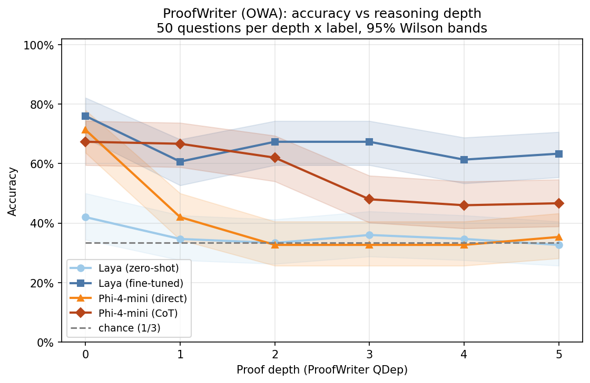

# Laya vs Phi-4-mini on ProofWriter: accuracy vs reasoning depth

## Question

[BoolQ](../2026-09-laya-vs-phi4-boolq) asked whether Laya can *find* an answer in a passage. ProofWriter asks whether it can *chain* facts together. Laya decides in one forward pass with no scratchpad, so the hypothesis is that it does well at proof depth 0–1 and falls off as depth grows. Phi-4-mini should degrade more slowly, especially when it reasons step by step before answering. The result is a plot of accuracy against depth, which tests that architectural claim directly instead of reporting one leaderboard number. A fine-tuned Laya arm checks whether training on multi-hop examples fixes the fall-off, or whether it persists and so points at the single forward pass.

## Models

| Arm | Params | How it answers | Hugging Face id |
|---|---|---|---|
| Laya (zero-shot) | 421M | One `choice` question (True / False / Unknown), one forward pass, 512-token window | [`convaiinnovations/laya`](https://huggingface.co/convaiinnovations/laya) (Apache-2.0) |
| Laya (fine-tuned) | 421M | The same, after ~3k ProofWriter *train* questions over depths 0–5 | fine-tuned from the above (not committed) |
| Phi-4-mini (direct) | 3.8B | "Answer with only True, False or Unknown", greedy | [`microsoft/Phi-4-mini-instruct`](https://huggingface.co/microsoft/Phi-4-mini-instruct) (MIT) |
| Phi-4-mini (CoT) | 3.8B | "Reason step by step…", then `Answer: …`, greedy, up to 512 new tokens | same |

Neither model requires a Hugging Face login.

## Dataset

The data is the official AI2 release, [ProofWriter](https://allenai.org/data/proofwriter) `proofwriter-dataset-V2020.12.3` (214 MB zip). The notebook downloads it from AI2's S3 bucket, which is where that page links. It uses the **open-world (OWA) `depth-5`** split, because only OWA has the third label, *Unknown*. Each question's depth is the release's own **`QDep`** field, which is never recomputed.

Each test theory is a paragraph of synthetic facts and rules ("Anne is kind. If someone is kind then they are round. …") with several statements to judge. The test sample is **stratified: 50 questions for each (QDep, label) cell, depths 0–5 × {True, False, Unknown}, 900 questions in total** (seed 42). Every depth has all three labels, and chance is exactly 1/3 at every depth. The notebook stops with an error if any cell is empty. The scarcest cell in the test split is depth-5 *Unknown*, with 63 questions. Unknowns at QDep 6–8 (10 test questions) are left out.

Theories are 69–265 Laya tokens long, and the mean barely changes with depth (155 at depth 0, 144 at depth 5). So every input fits Laya's window untruncated, and input length doesn't confound the depth curve. Train, dev and test share no theories.

## Method

- **Laya:** the theory is the `state`, and the question is one `choice` question. Its three options carry the label definitions: True = the statement follows from the facts and rules, False = its negation follows, Unknown = neither can be proved. Laya returns a probability for each option, and the prediction is the argmax. Batch size is 1.
- **Laya fine-tuned:** this uses the single-T4 port of Laya's official RLCD recipe from [`2026-09-laya-finetune-boolq`](../2026-09-laya-finetune-boolq), with the same hyperparameters (3 epochs, effective batch 64, LR 2.5e-5 / 1e-4, σ 0.4→0.1). The question type is `choice` instead of `noul`.
  - Training data: 3,006 questions from `meta-train`, 167 per (depth, label) cell.
  - Calibration: 306 questions from `meta-dev` track accuracy per epoch and fit the `choice` temperature.
- **Phi-4-mini (direct):** the prompt gives the same label definitions and ends "Answer with only True, False or Unknown." Decoding is greedy with 3 new tokens. The label probabilities are a softmax over the first token's logits for the True/False/Unknown variants.
- **Phi-4-mini (CoT):** the same system prompt, but the model is asked to reason step by step and finish with `Answer: True|False|Unknown`. Decoding is greedy with up to 512 new tokens, and the last `Answer:` is parsed. An output with no parseable answer counts as wrong, and the parse rate is reported.
- **Metrics:**
  - Accuracy per depth with 95% Wilson CIs, and per depth × label.
  - Overall accuracy, macro-F1 and parse rate.
  - Latency, CoT output length and peak GPU memory.
- **Degradation test:**
  - A per-arm logistic regression of `correct ~ QDep` gives each arm's slope in log-odds per extra proof step.
  - A GEE model `correct ~ QDep × arm`, clustered on question, tests whether each arm's slope differs from zero-shot Laya's.
  - Exact McNemar tests at each depth for the key pairs.

## How to run

1. Click **Open in Colab** above and choose **Runtime → Change runtime type → T4 GPU**.
2. Click **Runtime → Run all**. A T4 should take roughly 1.5 hours in total:
   - Laya zero-shot: about 1 minute
   - fine-tuning: about 15–20 minutes
   - Phi-4-mini direct: a few minutes
   - Phi-4-mini CoT: about 40–60 minutes

   Model outputs, the dataset zip and the fine-tuned checkpoint are cached, so a rerun after a disconnect resumes. Set `USE_DRIVE = True` to keep them on Google Drive, which is recommended for a run this long.
3. For a quick check first, set `N_PER_CELL = 2`, `N_TRAIN_PER_CELL = 4`, `N_CALIB_PER_CELL = 2` and `EPOCHS = 1`. Before the full run, delete `laya_proofwriter_ft/` and the `*.json`/`*.jsonl` files in `cache/`, or the quick check's checkpoint and training history will be reused.
4. Download the results zip and commit `figures/`, `results.csv`, `by_depth.csv` and `summary.csv` here. The dataset zip and the ~850 MB checkpoint are not committed.

To run locally, use `pip install -r requirements.txt` and a CUDA GPU with at least 12 GB of memory.

## Results

900 test questions (50 per depth × label, depths 0–5), run on a Colab T4 in fp16. This run used `COT_MAX_NEW_TOKENS = 512`. The per-question outputs, including every CoT trace, are in [`results.csv`](results.csv). Per-depth and per-label numbers are in [`by_depth.csv`](by_depth.csv).

### Accuracy by depth (%)

Each point is ±~7.5 points (95% Wilson CI). Chance is 33%.

| QDep | Laya zero-shot | Laya fine-tuned | Phi-4-mini direct | Phi-4-mini CoT | "not" shortcut |
|---|---|---|---|---|---|
| 0 | 42.0 | **76.0** | 71.3 | 67.3 | 60.7 |
| 1 | 34.7 | 60.7 | 42.0 | **66.7** | 65.3 |
| 2 | 33.3 | **67.3** | 32.7 | 62.0 | 66.7 |
| 3 | 36.0 | **67.3** | 32.7 | 48.0 | 65.3 |
| 4 | 34.7 | **61.3** | 32.7 | 46.0 | 66.0 |
| 5 | 32.7 | **63.3** | 35.3 | 46.7 | 61.3 |
| **Overall** | 35.6 | **66.0** | 41.1 | 56.1 | 64.2 |
| Slope (log-odds per depth step) | −0.06 (p = 0.18) | −0.08 (p = 0.06) | −0.25 (p = 1e-9) | −0.21 (p = 2e-7) | – |
| ms per question | 71 (batch 1) | 44 (batch 1) | 112 (batch 8) | 3,680 (batch 8) | – |
| Peak GPU memory | 2.4 GB | 4.1 GB | 10.4 GB | 10.4 GB | – |

- **Slopes:** in the GEE model (clustered on question), fine-tuned Laya's slope is significantly flatter than Phi direct's (p = 0.006) and Phi CoT's (p = 0.015). It isn't significantly different from zero-shot Laya's (p = 0.67).
- **Fine-tuned Laya vs Phi CoT (exact McNemar):** fine-tuned Laya is ahead by +1 point at depths 0–1 (p = 0.77), +12 at 2–3 (p = 0.001) and +16 at 4–5 (p = 0.0002).
- **Fine-tuning** took 12.6 minutes (3 epochs, 3,006 examples, peak 8.3 GB). The fitted `choice` temperature was 1.97.

### Findings

**1. A surface cue predicts True vs False: the word "not".**

In the release, 95% of False statements contain "not" and 95% of True ones don't. That holds in train, dev and test alike. Unknown statements are 50/50. So "False if it says *not*, otherwise True, never Unknown" scores **64.2%**, flat across depth (61–67%), without any reasoning. [`scripts/shortcut_analysis.py`](scripts/shortcut_analysis.py) reproduces this from the official release.

**2. Fine-tuned Laya's flat 66% sits on top of that shortcut.**
- On gold True/False questions it answered True or False, it agrees with the shortcut 97.4% of the time (463 questions).
- It almost never confuses True with False: once in 600 gold True/False questions. Nearly all its errors are about whether a statement can be proved at all.
- It isn't only the shortcut: it got all 11 questions right where the shortcut is wrong.
- But the shortcut explains most of its True/False accuracy, and it's flat across depth by construction. So the flat curve and the significantly flatter slope are **not evidence** that Laya chains facts.

**3. Zero-shot Laya never did the task.**
- It answered False 89% of the time at every depth, including 83% of gold-True and 89% of gold-Unknown questions. Its mean P(False) was 0.59.
- Accuracy is at chance even at depth 0 (42%), so its flat slope reflects no signal, not robustness.
- The likely cause is the 3-way `choice` format. The *False* option's definition ("the negation … follows") may pull statements containing "not" towards False. The [ProntoQA follow-up](../2026-09-laya-vs-phi4-prontoqa) switched to the `noul` (yes/no) type that worked on BoolQ.

**4. Phi-4-mini direct is a lookup, not a chainer.**
- It gets 90% of depth-0 True questions, where the fact is written in the text. From depth 1 on it defaults to *Unknown*, which is 68% of all its answers.
- Accuracy falls from 71% to chance by depth 2.
- It treats "not written down" as "can't be proved". This is the fall-off the hypothesis predicted for Laya.

**5. Phi-4-mini CoT holds up to depth 2, then drops.**
- It stays at 62–67% through depth 2, then drops to 46–48%. Its slope (−0.21) isn't meaningfully flatter than direct's (−0.25).
- 7.2% of outputs hit the 512-token limit or had no parseable answer, which counts as wrong. Counting only parsed answers, it goes from 73% to 51%.
- *Unknown* is its weakest label (41%). It often invents a proof: 29% of gold-Unknown questions were answered True.

**6. The shortcut-free view: provable vs Unknown.** "Not" is no help in deciding whether a statement can be proved at all, because Unknown is 50/50 on "not". Balanced accuracy on that question (chance 50%):

| QDep | Laya zero-shot | Laya fine-tuned | Phi direct | Phi CoT |
|---|---|---|---|---|
| 0 | 49.5 | 70.5 | 75.0 | 72.5 |
| 1 | 50.5 | 54.0 | 56.0 | 66.5 |
| 2 | 49.0 | 60.5 | 50.0 | 65.0 |
| 3 | 50.5 | 62.5 | 53.5 | 55.5 |
| 4 | 48.5 | 57.0 | 49.5 | 53.5 |
| 5 | 48.0 | 59.0 | 54.0 | 59.5 |

On this measure, every arm that learned anything falls off sharply after depth 0, then hovers at 55–65%. Fine-tuned Laya and Phi CoT come out about the same: CoT is better at depths 1–2 and Laya slightly better at 3–5. Neither a single forward pass nor ~200 tokens of step-by-step reasoning reliably tracks whether a proof exists beyond one hop.

### What this means for the hypothesis

| Hypothesis | Verdict |
|---|---|
| Laya does well at depth 0–1 and falls off as depth grows | **Not supported as run.** Zero-shot Laya is at chance even at depth 0. The fine-tuned version's flat curve is mostly the "not" shortcut. |
| Phi-4-mini degrades more slowly than Laya | **Not testable** from the headline accuracy, because the shortcut inflates fine-tuned Laya. On provable vs Unknown, the two are about equal. |
| Phi-4-mini's accuracy falls with depth | **Supported** for both direct (p = 1e-9) and CoT (p = 2e-7). |
| Step-by-step reasoning degrades more slowly than answering directly | **Partly.** CoT is far better at depths 1–2 (+25 and +29 points), but its slope isn't meaningfully flatter. |

The fine-tuned Laya result is still worth noting on cost. It beats Phi-4-mini CoT by 10 points overall (p = 7e-6) after 12.6 minutes of training, with 4.1 GB against 10.4 GB, and about 80× less time per question. But the claim it supports is "fine-tuned Laya beats Phi-4-mini on ProofWriter", not "Laya chains facts".

### Next steps (hypotheses to test)

1. **Balance the test sample on "not".** Make "not" equally common within every depth × label cell, so the shortcut scores chance. The limit is the rarest cell (depth-3 False without "not", 17 test questions), which gives about 612 questions.
2. **Use provable-vs-Unknown as the depth metric** alongside accuracy, and plot the 64% shortcut line on the headline figure.
3. **Retry zero-shot Laya with two `noul` questions** ("Do the facts and rules prove the statement?" / "…prove it is false?"), mapped to True/False/Unknown.
4. **Raise the CoT limit to 1,024 tokens** and stop generation at the first `Answer:` line.

Rather than fix ProofWriter, the next experiment moved to [ProntoQA](../2026-09-laya-vs-phi4-prontoqa), which is shortcut-free on "not". It turned out to have its own shortcut for fine-tuned models: the distractor rule's concept never recurs. The lesson common to both: fine-tuning on generated reasoning data teaches the generator's quirks, so every quirk needs a control.
